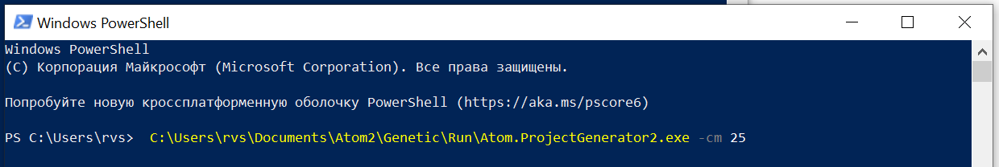

# Atom2 - Система для автоматической оптимизации план-графика работ.

Приложение для просмотра план-графиков
https://alexmodone.github.io/newsite/index.html

## Информация:
Данная программа явяляется первым этапом приближения решения задачи календарного планирования.  
Релиз версия сырая и показывает только принцип работы.
Для расмотрения алгоритма необходимо использовать среду разработки.

Генетический алгоритм.  

Популяция: план-графики   

Мутации: план-графика  

Гены:   
* Работа (сдвиг, сужение)  
* Веха (сдвиг, сужение)  

Функция приспособленности:  
* Штраф за сдвиг        
* Штраф за сужение     

Гарантировано находим локальный экстремум. 

## Требования
netcoreapp3.1       
Visual Studio 2019

## Запуск

-cm -- приемлемая стоимость
     

C:\Users\rvs\Documents\Atom2\Genetic\Run\Atom.ProjectGenerator2.exe -cm 25

